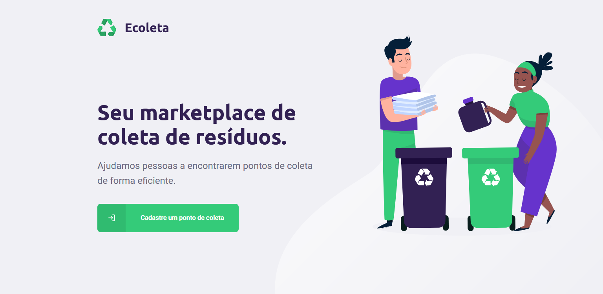
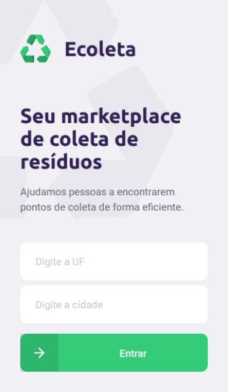

# Ecoleta

## Descrição

Um projeto totalmente voltado para fins ecológicos, um marketplace de coleta de resíduos. O [TypeScript](https://www.typescriptlang.org/) foi utilizado durante o desenvolvimento de todo o projeto.

## Back-end

No desenvolvimento da API Rest foi utilizado o [Node.js](https://nodejs.org/en/).

## Web

A aplicação Web foi feita usando [ReactJS](https://pt-br.reactjs.org/).

## Mobile

O aplicatico mobile foi desenvolvido usando [React Native](https://reactnative.dev/), além disso, foi utilizado o [Expo](https://expo.io/), uma ferramenta que facilita o desenvolvimento mobile.

